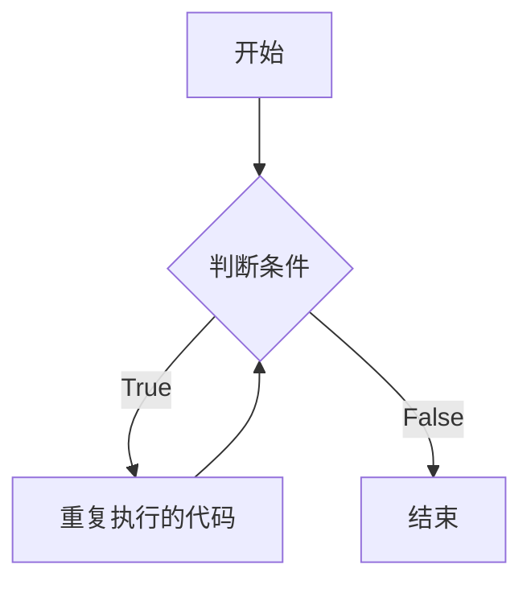
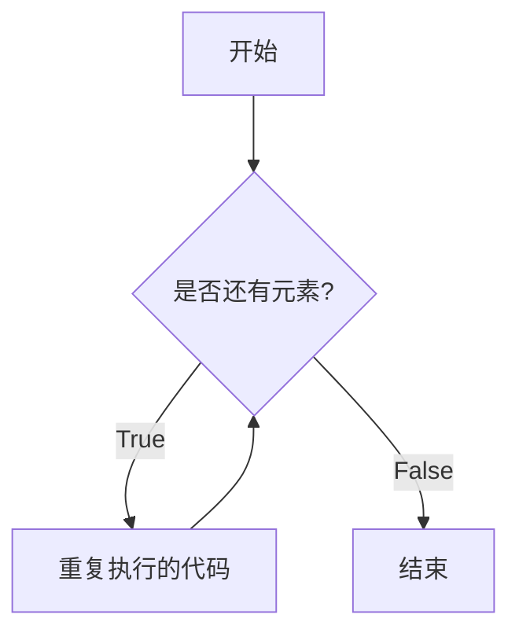

# Python 循环

## 引言

> 在 `Python` 语法中有两类循环
>
> - `while` 循环
> - `for` 循环
>
> 并介绍关键字 `continue` 和 `break` 在循环中的作用。

<br/>

## 程序的基本结构

在程序开发中，一共有三种基本结构：

- **顺序** —— **从上向下**，顺序执行代码
- **分支 / 选择** —— 根据条件判断，决定执行代码的 **分支**
- **循环** —— 让 **特定的代码重复** 执行


<br/>

##  `while` 循环基本使用

- 循环的作用就是让 **指定的代码** 重复的执行
- `while` 循环最常用的应用场景就是 **让执行的代码** 按照 **指定的次数** **重复** 执行

<br/>

### `while` 语句基本语法

```python

while 判断条件:
    循环体语句
    
```

<br/>

> 注意：`while` 语句以及缩进部分是一个 **完整的代码块**

<br/>

### while 循环流程图



<br/>

### while 循环案例

**打印 5 遍 Hello Python**

```python
In [22]: 
In [23]: i = 1	# 定义重复次数计数器

In [24]: while i <= 5:
    ...:     print('Hello Python')
    ...:
    ...:     # 处理计数器 i
    ...:     i = i + 1
    ...:
Hello Python
Hello Python
Hello Python
Hello Python
Hello Python    
```

<br/>

**打印小星星**

**需求**

- 在控制台连续输出五行 `*`，每一行星号的数量依次递增

```
*
**
***
****
*****
```

- 使用字符串 `*` 打印

```python
#!/usr/bin/python3
# -*- coding:utf-8 -*-

# 定义一个计数器变量，从数字1开始，循环会比较方便
row = 1

while row <= 5:

    print("*" * row)

    row += 1

```

<br/>

### Python 中的计数方法

常见的计数方法有两种，可以分别称为：

- **自然计数法**（从 `1` 开始）—— 更符合人类的习惯
- **程序计数法**（从 `0` 开始）—— 几乎所有的程序语言都选择从 `0` 开始计数

作为程序员的我们，在编写程序时，尽量养成习惯：**除非需求的特殊要求，否则 循环 的计数都从 `0` 开始**

<br/>

### `while` 循环嵌套

> `while` 嵌套就是：`while` 里面还有 `while`

<br/>

**基本语法**

```python
while 条件 1:
    外层循环体
    ...
    
    while 条件 2:
        内层循环体
        ...
   
	外层循环体
    ...
```

 <br/>

**假设** `Python` **没有提供** 字符串的 `*` 操作 **拼接字符串**

**需求**

- 在控制台连续输出五行 `*`，每一行星号的数量依次递增

```python
*
**
***
****
*****
```

<br/>

**开发步骤**

- 1）完成 5 行内容的简单输出
- 2）分析每行内部的 `*` 应该如何处理？
  - 每行显示的星星和当前所在的行数是一致的
  - 嵌套一个小的循环，专门处理每一行中 `列` 的星星显示  

```python
#!/usr/bin/python3
# -*- coding:utf-8 -*-

row = 1

while row <= 5:

    # 假设 python 没有提供字符串 * 操作
    # 在循环内部，再增加一个循环，实现每一行的 星星 打印
    col = 1

    while col <= row:
        print("*", end="")

        col += 1

    # 每一行星号输出完成后，再增加一个换行
    print()

    row += 1
```

<br/>

**`print()` 函数加强**

- 在默认情况下，`print` 函数输出内容之后，会自动在内容末尾增加换行
- 如果不希望末尾增加换行，可以在 `print` 函数输出内容的后面增加 `, end=""`
- 其中 `""` 中间可以指定 `print` 函数输出内容之后，继续希望显示的内容
- 语法格式如下：

```python
# 向控制台输出内容结束之后，不会换行
print("*", end="")

print("*", end="  ")	# 末尾增加两个空格, 不换行

print("*", end="\t")	# 末尾增加一个制表符位(tab), 不换行

# 单纯的换行
print()
```

> `print()` 函数中 `end=""` 表示向控制台输出内容结束之后，不会换行

<br/>

### 死循环

> 由于程序员的原因，**忘记** 在循环内部 **修改循环的判断条件**，导致循环持续执行，程序无法终止！

```python
# 一直输出 hello
i = 0
while i <= 10:
    print('hello')
    
    # i = i + 1
```

在控制台中可以按 `Ctrl + C` 来进行强制退出死循环。

<br/>

## `for` 循环基本使用

> `Python` 中 `for` 循环可以遍历一切 **可迭代对象（Iterable）**，例如一个列表、字符串等。

可迭代对象，在[【Python 高级进阶】](https://juejin.cn/column/6960599942540820493)专栏有详细介绍，大家如果想具体了解，可以先移步到 [Python 迭代器](https://juejin.cn/post/6948437239286202375) 查看

<br/>

### for 语句基本语法

```python

for 变量 in 可迭代对象:
    循环体
    
```

<br/>

### for 循环流程图



<br/>

### for 循环实例

**遍历编程语言列表**

```python
In [1]: languages = ['C', 'Python', 'Java', 'C++', 'Php']

In [2]: for lang in languages:
   ...:     print(lang)
   ...:
C
Python
Java
C++
Php

In [3]:
```

<br/>

**遍历字符串**

```python
In [3]: message = '人生苦短，我用Python'

In [4]: for msg in message:
   ...:     print(msg)
   ...:
人
生
苦
短
，
我
用
P
y
t
h
o
n

In [5]:
```

<br/>

### 遍历 `range()` 生成的数字序列

**`range()` 语法**

```python
range(start, stop[, step])
```

<br/>

**参数说明：**

- ***start***: 计数从 start 开始。默认是从 0 开始。例如 `range(3)`等价于 `range(0, 3)`
- ***stop***: 计数到 stop 结束，但**不包括 `stop`**。例如 `range(0, 5)` 是 `[0, 1, 2, 3, 4]` 没有5
- ***step***：步长，**默认为 `1`**。例如 `range(0, 3)` 等价于 `range(0, 3, 1)`

<br/>

**IPython 测验**

```python
In [10]: # 只指定 start
    
In [11]: list(range(6))
Out[11]: [0, 1, 2, 3, 4, 5]

In [12]: # start、stop都指定

In [13]: list(range(3, 10))
Out[13]: [3, 4, 5, 6, 7, 8, 9]

In [14]: # start、stop、step都指定

In [15]: list(range(0, 10, 2))
Out[15]: [0, 2, 4, 6, 8]
```

这样要使用 `list` 才能展示其内部元素。

<br/>

**`for` 循环遍历 `range()`**

```python
In [16]: # for 循环遍历 range()

In [17]: for i in range(6):
    ...:     print(i)
    ...:
0
1
2
3
4
5

In [18]: for i in range(3, 9):
    ...:     print(i)
    ...:
3
4
5
6
7
8

In [19]: for i in range(0, 10, 2):
    ...:     print(i)
    ...:
0
2
4
6
8

In [20]:
```

<br/>

### for 循环嵌套

> `for` 嵌套就是：`for` 里面还有 `for`

<br/>

**基本语法**

```python
for 变量 in 可迭代对象:
    外层循环体
    ...
    
    for 变量 in 可迭代对象:
        内层循环体
        ...
    
    外层循环体
    ...
```

 <br/>

**案例：** 求 `1! + 2! + 3! + 4! + 5!`，`[1, 5]` 之间的阶乘累加之和。

- 2的阶乘 `2!`，就是 `1 * 2`

- 3的阶乘 `3!`，就是 `1 * 2 * 3`
- 。。。

<br/>

程序设计如下

```python
#!/usr/bin/python3
# -*- coding:utf-8 -*-

total = 0

for i in range(1, 6):
    
    # 计算 i 的阶乘
    temp = 1
    for j in range(1, i+1):
        temp = temp * j
    
    # 每个阶乘累加
    total = total + temp
    
print(total)	# 结果为153
```

<br/>

## break 和 continue

> `break` 和 `continue` 是专门在循环中使用的关键字，用于循环的中断。

- **`break` ，退出本层循环，不再执行后续的代码**
- **`continue` ，终止本次循环，不执行后续的代码，再次进行循环条件判断**

> `break` 和 `continue` 只针对 **当前所在循环** 有效

<br/>

### break

- **在循环过程中**，如果 **某一个条件满足后**，**不** 再希望 **循环继续执行**，可以使用 `break` 退出循环

```python
i = 0

while i < 10:

    # break 某一条件满足时，退出循环，不再执行后续重复的代码
    # i == 3
    if i == 3:
        break

    print(i)

    i += 1

print("over")
```

<br/>

> `break` 只针对当前所在循环有效

<br/>

### continue

- **在循环过程中**，如果 **某一个条件满足后**，**不** 希望 **执行循环代码，但是又不希望退出循环**，可以使用 `continue`
- 也就是：在整个循环中，**只有某些条件**，不需要执行循环代码，而其他条件都需要执行

```python
i = 0

while i < 10:

    # 当 i == 7 时，不希望执行需要重复执行的代码
    if i == 7:
        # 在使用 continue 之前，同样应该修改计数器
        # 否则会出现死循环
        i += 1

        continue

    # 重复执行的代码
    print(i)

    i += 1

```

- 需要注意：使用 `continue` 时，**条件处理部分的代码，需要特别注意**，不小心会出现 **死循环**

> `continue` 只针对当前所在循环有效

<br/>

## Python 循环的 else 语法

> `Python` 循环语句 `for, while` 有可能带一个 `else` 分支，当一个 `for` 循环正常执行完毕时或者当一个`while` 循环正常执行完毕（循环条件变为False）时它被触发执行，**但是如果这个循环被 `break` 语句非正常中止时，则这个 `else` 分支不执行。**

<br/>

### while ... else ...

```python
while 循环条件:
    
    循环体
    ...
else:
	循环正常结束    
```

<br/>

### for ... else ...

```python
for 变量 in 可迭代对象:
    
    循环体
    
else:
    循环正常结束
```

<br/>

### IPython 测验

```python
# for 循环
In [1]: for i in range(5):
   ...:     print(i)
   ...: else:
   ...:     print('for 循环正常结束')
   ...:     print(i)
   ...:
0
1
2
3
4
for 循环正常结束
4


# while 循环
In [2]: num = 1
   ...:
   ...: while num <= 5:
   ...:     print(num)
   ...:     num = num + 1
   ...: else:
   ...:     print('while 循环正常结束')
   ...:     print(num)
   ...:
1
2
3
4
5
while 循环正常结束
6


# break中断
In [3]: for i in range(10):
   ...:     print(i)
   ...:     if i == 5:
   ...:         break
   ...: else:
   ...:     print('for 循环正常结束')
   ...:     print(i)
   ...:
0
1
2
3
4
5
```

<br/>

### 应用场景

例如 `Python` 官方文档中的寻找素数的例子 - **打印10以内的素数**

```python
for n in range(2, 10):
	for x in range(2, n):
		if n % x == 0:
			print(n, 'equals', x, '*', n//x)
			break
	else:
		# loop fell through without finding a factor
		print(n, 'is a prime number')

```

<br/>

**运行结果如下：**

```python
2 is a prime number
3 is a prime number
4 equals 2 * 2
5 is a prime number
6 equals 2 * 3
7 is a prime number
8 equals 2 * 4
9 equals 3 * 3
```

<br/>

## 循环实战小案例

###  `[0, 100]` 之间所有偶数的累加求和结果

```python
# 0. 用于统计最终结果
result = 0

# 1. 计数器
i = 0

# 2. 开始循环
while i <= 100:

    # 判断偶数
    if i % 2 == 0:
        result += i  # 进行累加
        
    i += 1

print(result)	# 结果为: 2550

```

<br/>

### 打印等腰三角形

**需求**

- 打印 `n` 层的等腰三角形
- 使用字符串 `*` 打印

- 每层 `*` 的数量按照 `1, 3, 5, 7, 9` 的方式依次递增，且构成等腰三角形

<br/>

例如 `5` 层的等腰三角形如下显示：

```
    *
   ***
  *****
 *******
*********
```

<br/>

**程序设计如下**

```python
#!/usr/bin/python3
# -*- coding: utf-8 -*-

while True:
    level = input('请输入要打印等腰三角形的层数(输入q退出): ')

    if level == 'q':
        break

    # 转成 int 整型
    level = int(level)

    row = 1     # 层级计数器

    while row <= level:

        # 计算每层空格的数量
        space_count = level - row
        print(' ' * space_count, end='')    # 打印空格并不换行

        # 计算每层 * 的数量
        char_count = row * 2 - 1
        print('*' * char_count)             # 打印每层的 * 然后换行

        # 层级计数加 1
        row = row + 1
```

<br/>

**运行结果如下：**

```python
请输入要打印等腰三角形的层数(输入q退出): 3
  *
 ***
*****
请输入要打印等腰三角形的层数(输入q退出): 5
    *
   ***
  *****
 *******
*********
请输入要打印等腰三角形的层数(输入q退出): 7
      *
     ***
    *****
   *******
  *********
 ***********
*************
请输入要打印等腰三角形的层数(输入q退出): q

Process finished with exit code 0
```

<br/>

### 打印 99乘法口诀表

```python
for i in range(1, 10):
    for j in range(1, i + 1):
        # print(f'{j} * {i} = {j * i}', end='\t')
        print('%d * %d = %d' % (j, i, j * i), end='\t')  # 每行用使用tab制表符隔开
    print()
```

<br/>

这样使用到了字符串的格式化输出，其中

- `f'{j} * {i} = {j * i}'`，在字符串前面加上 `f` ，就是**模板字符串**，在字符串里面可以直接使用`{xxx}` 来引用变量或进行相应的运算。
- `'%d * %d = %d' % (j, i, j*i)'`，则是格式化字符串，`%d` 代表格式整型数字 `%` 后面的数据会依次填充 `%d` 的占位。

这里只做一个初步介绍，在后续的 **字符串** 讲解中会进行详细介绍。

<br/>

**运行结果如下：**


<br/>

## 尾语

**✍ 用  Code 谱写世界，让生活更有趣。❤️**

**✍ 万水千山总是情，点赞再走行不行。❤️**

**✍ 码字不易，还望各位大侠多多支持。❤️**

<br/>


